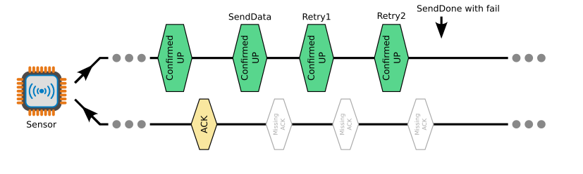
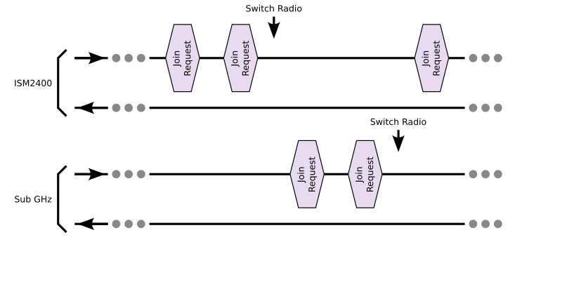

# LoRa Component for ESP32


Basic usage:

1. Call `LoRaComponHwInit()` at start up, to initialise related hardware.
2. Call `LoRaComponStart()` to start the LoRa component.
3. Using `LoRaComponIsJoined()` to check JOIN status.
4. After JOIN, you can use `LoRaComponSendData()` to send data. Then use `LoRaComponIsSendDone()` to check the transmission is finished or not. After it is done, using the `LoRaComponIsSendSuccess()` to check it is success.
5. Using `LoRaComponIsRxReady()` to check if there is data received. Then use `LoRaComponGetData()` to get the received data, and related information if needed.


*Important: Please initialise the NVS (call `nvs_flash_init()`) at your application first.*

## Confirmed and Unconfirmed Uplink 

When sending data via `LoRaComponSendData()`, the component will decide to use a Confirmed uplink or not. The `LORAWAN_UNCONFIRMED_COUNT` could control how this being handled in the component.

#### Example 1:

```
LORAWAN_UNCONFIRMED_COUNT=0
```

It will always sending a Confirmed Uplink.


#### Example 2:

```
LORAWAN_UNCONFIRMED_COUNT=4
```

It will send a Confirmed Uplink once after 4 Unconfirmed Uplink.


## Retry of Uplink

When sending a Confirmed Uplink, it will expecting a ACK being received. If not, the component will retry the Uplink. The number of retry is set by `LORAWAN_MAX_NOACK_RETRY`. When the number of retry reached, the sending process is done and reported as failure.

The `LORAWAN_NOACK_RETRY_INTERVAL` control the time interval between each retry, in seconds.

An example of `LORAWAN_MAX_NOACK_RETRY=2`.




## Link Down

When a consecutive send fail happening, the component will treat it as a link down. Then it will start over and try to JOIN again. The `LORAWAN_LINK_FAIL_COUNT` is controlling how many consecutive fail before a link down.

An example of `LORAWAN_LINK_FAIL_COUNT=5` and `LORAWAN_MAX_NOACK_RETRY=2`.


## Switching Radio Chip

When the LORAWAN_SW_RADIO_COUNT is greater than 0, the component will switch the Radio chip if failed to join for the specified number of times.

An example of `LORAWAN_SW_RADIO_COUNT=2`.



